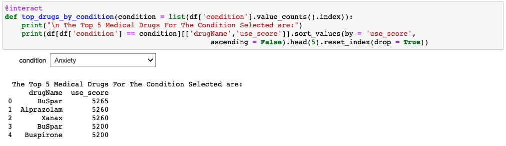
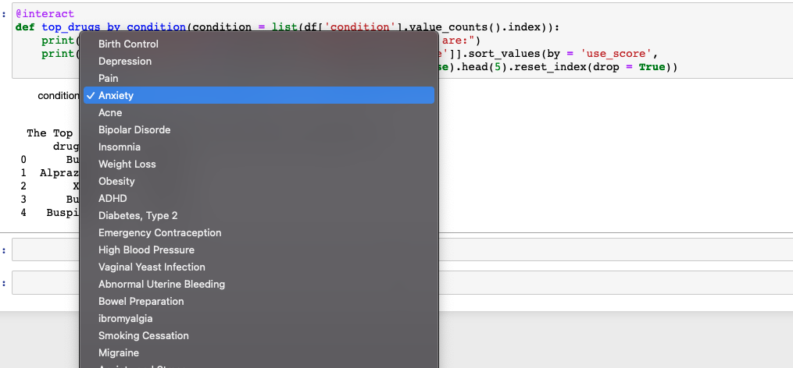

# Medical_Drugs_Conditions

---

### Abstract:

For this project, we will be using Natural Language Processing techniques to evaluate patient’s reviews and ratings of medical conditions and drugs. The data comes from UCI ML which contains over 160k reviews which was obtained by crawling online pharmaceutical review sites. Below is a sample of the data which has 0 to 10 ratings for a particular drug and condition as well as the comment left by the patient and the number of patients that found the drug useful.  

EDA was performed to get a full understanding of the dataset. Then, Sentiment analysis was performed but results were unreliable. Therefore, feature engineering was performed to get accurate scores bases on the the patient's reviews and ratings.  An interactive app was created to allow the patient to select a medical condition and the app displays the top 5 medications for that particular medical condition based on the reviews and comments left from previous patients. 

---

### Design:

 The growth of the internet and technology over the past two decades have allowed many humans to learn something that was not possible 30 years ago. The access to online information is unimaginable and medical patients have greatly benefited by utilizing web platforms to inquire about other patient’s experiences, views and suggestions about a particular medical condition or medical drugs. Patients are no longer limited to getting this information from known family members or a particular medical doctor allowing them to make a better-informed decision. 

A medical drug is first tested and evaluated before its approval, but there are still instances where the drug must be withdrawn from the market due to some unexpected side effects. These unexpected side effects are often reported online review sites, healthcare web forums and discussion boards. However, the unstructured textual nature of the reviews was often time consuming for healthcare professionals and difficult to digest in a timely manner. The emergence of Natural Language Processing (NLP) and Sentiment Analysis has made big impact in the industry by allowing them to identify, extract and make use of subjective information. 

For this project, we will be using Natural Language Processing techniques to evaluate patient’s reviews and ratings of medical conditions and drugs. 

---

### Data

The Drug Reviews dataset is taken from the UCI Machine Learning Repository. This Dataset provides patient reviews on specific drugs along with related conditions and a 10-star patient rating reflecting the overall patient satisfaction. The data was obtained by crawling online pharmaceutical review sites. The Drug Review Data Set is of shape (161297, 7) i.e. It has 7 features including the review and 161297 Data Points or entries.

To access and view a detailed description of the dataset, [UCI Drug Reviews]([https://archive.ics.uci.edu/ml/datasets/Drug+Review+Dataset+%28Drugs.com%29])

[CLICK HERE]([https://archive.ics.uci.edu/ml/datasets/Drug+Review+Dataset+%28Drugs.com%29])

Attribute Information:

1. 'drugName' which is the name of the drug
2. 'condition' which is the condition the patient is suffering from
3. 'review' is the patients review
4. 'rating' is the 10-star patient rating for the drug
5. 'date' is the date of the entry 
6. 'usefulcount' is the number of users who found the review useful

---

### Natural Language Processing

1.	Vader Sentiment Intensity Analyzer
2.	TextBlob
3.	NLTK Tokenizers
4.	NLTK Corpus

---

### **TOOLS**

The following tools were used in this project:
1.	Python & Pandas to clean and explore 
2.	Matplotlib and Seaborn to generate visualizations
3.	NLTK Tools such as Corpus, Tokenizers, Vader
4.	TextBlob
5.	Streamlit to develop the app
6.	Heroku to deploy the app
7.	Docker to create a smooth pipeline

---

### Communication

The findings and slide deck accompanying this project's presentation are accessible in this GitHub repository.

