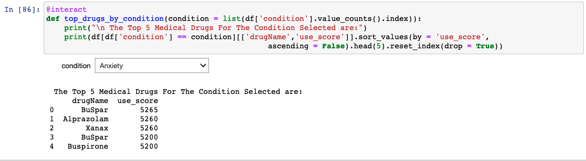

# Medical_Drugs_Conditions

---

### Abstract:

For this project, we will be using Natural Language Processing techniques to evaluate patient’s reviews and ratings of medical conditions and drugs. The data comes from UCI ML which contains over 160k reviews which was obtained by crawling online pharmaceutical review sites. Below is a sample of the data which has 0 to 10 ratings for a particular drug and condition as well as the comment left by the patient and the number of patients that found the drug useful.  

---

### Design:

 A pipeline was built to collect the data and perform machine learning to predict if the transaction was fraud and deployed an app to show the results. 

---

### Data

The data is from UCI Machine Learning Repository. 

To access and view a detailed description of the dataset, [UCI Hepatitis Data]([https://archive.ics.uci.edu/ml/datasets/hepatitis])

[CLICK HERE]([https://www.kaggle.com/mathchi/churn-for-bank-customers](https://archive.ics.uci.edu/ml/datasets/hepatitis))

Attribute Information:

1. Class: DIE, LIVE
2. AGE: 10, 20, 30, 40, 50, 60, 70, 80
3. SEX: male, female
4. STEROID: no, yes
5. ANTIVIRALS: no, yes
6. FATIGUE: no, yes
7. MALAISE: no, yes
8. ANOREXIA: no, yes
9. LIVER BIG: no, yes
10. LIVER FIRM: no, yes
11. SPLEEN PALPABLE: no, yes
12. SPIDERS: no, yes
13. ASCITES: no, yes
14. VARICES: no, yes
15. BILIRUBIN: 0.39, 0.80, 1.20, 2.00, 3.00, 4.00
-- see the note below
16. ALK PHOSPHATE: 33, 80, 120, 160, 200, 250
17. SGOT: 13, 100, 200, 300, 400, 500,
18. ALBUMIN: 2.1, 3.0, 3.8, 4.5, 5.0, 6.0
19. PROTIME: 10, 20, 30, 40, 50, 60, 70, 80, 90
20. HISTOLOGY: no, yes

---

### Machine Learning Algorithms

Machine Learning classification algorithms:
1.	Logistic Regression
2.	DecisionTree

---

### **TOOLS**

The following tools were used in this project:
1.	SQL, Python & Pandas to clean, explore and generate the final modeling data
2.	Matplotlib and Seaborn to generate visualizations
3.	SKLearn to build Machine Learning classification models and measuring metrics
4.	Streamlit to develop the app
5.	Heroku to deploy the app
6.	Docker to create a smooth pipeline

---

### Communication

The findings and slide deck accompanying this project's presentation are accessible in this GitHub repository.

